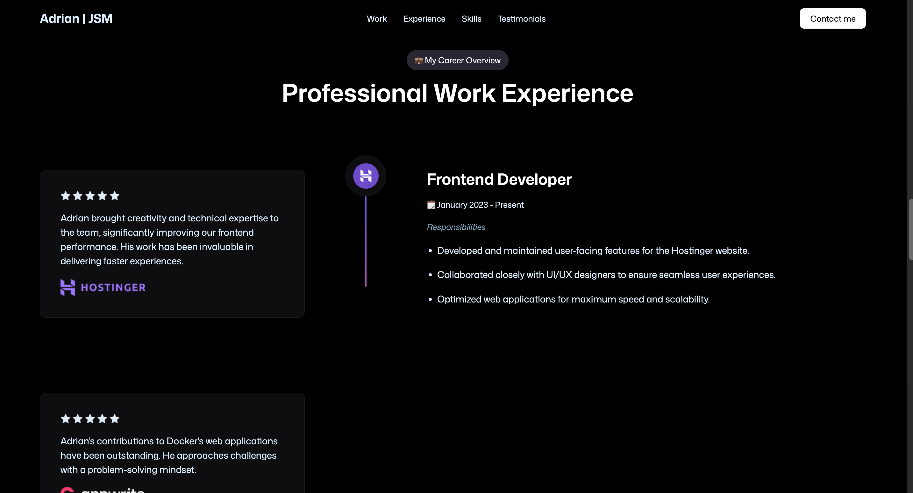

## Adrian's Portfolio
it's a 3D model portfolio application

### Built with

- React
- Tailwind
- EmailJs

### Live Demo
[demo](https://3-d-portfolio-eight-delta.vercel.app/)

### Available Scripts

First of all clone this repository.

In the project directory, you can run:

- step 1: run `npm install` (wait untill all node-modules are in place) 

- step 2: run `npm run dev` (open the project in the browser)

## License

